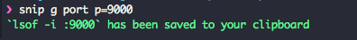

snip
============
Command line interface to save snippets, shortcuts, commands, etc.

Table of Content
----------------
* [Usage](#usage)
    * [Add](#add)
    * [List](#list)
    * [Search](#search)
    * [Generate](#generate)
    * [Execute](#execute)
    * [Remove](#remove)
* [Requirements](#requirements)
* [Install](#install)
* [Autocomplete](#autocomplete)
* [Test](#test)
* [License](#license)
* [Author](#author)


Usage
--------
```
NAME:
   main - Save snippets: commands, texts, emoji, etc.

USAGE:
   main [global options] command [command options] [arguments...]

VERSION:
   3.0.0

COMMANDS:
     add, a       snip add -k="port" -c="lsof -i :{p}" -desc="List processes listening on a particular port"
     search, s    search for snippets: snip search port
     generate, g  generate the snippet by keyword: snip g port p={9000}
     execute, x   execute the snippet by keyword: snip x port p={9000}
     list, l      list all saved snippets: snip list
     remove, r    remove a saved snippet: snip remove port
     help, h      Shows a list of commands or help for one command

GLOBAL OPTIONS:
   --help, -h     show help
   --version, -v  print the version
```

### Add

```bash
snip add -k="port" -c="lsof -i :{p}" -desc="List processes listening on a particular port"
```

Use `{placeholder}` for placeholders. See [Execute](#execute) for more on this

### List

```bash
snip list
```

you should see:


### Search

```bash
# by substring of keyword
snip search port
# by substring of description
snip search "list process"
```

you should see:


### Generate

```bash
snip generate port p=9000
```

This will replace the placeholder `{p}` with `9000`:



```bash
snip g port p=9000 -o
```

> For multiple placeholders {p} {a} {b}: snip x port p=9000 a=hello b=world

### Execute

```bash
snip x port p=9000
```

This will execute the snippet and print the output to your console.

Or, add `--ouput` / `-o` option to save the *output* of the command to the clipboard.


### Remove

```bash
snip remove port
```

To remove a snippet by keyword


Requirements
-------------
* Go ^1.8

Install
------
```
go get -u gopkg.in/baopham/snip.v3
```

Make sure you have `$GOPATH` set and `$GOPATH/bin` is in the `$PATH`, e.g.:

```bash
export GOPATH=$HOME/Projects/Go
export PATH=$PATH:/usr/local/opt/go/libexec/bin:$GOPATH/bin
```

Autocomplete
-----------

To have autocomplete enabled, source [snip_bash_autocomplete](autocomplete/snip_bash_autocomplete) or [snip_zsh_autocomplete](autocomplete/snip_zsh_autocomplete).
E.g. copy one of these (depending on your shell) to `/local/path` and then add the below to your `.bashrc` or `.zhsrc`:

> If your shell is zsh, we recommend:  
> autoload -U compinit && compinit  
> autoload -U bashcompinit && bashcompinit  

```bash
source /local/path/snip_bash_autocomplete
# Or
source /local/path/snip_zsh_autocomplete
```

Test
----

```
go get github.com/onsi/ginkgo/ginkgo
go get github.com/onsi/gomega
ginkgo -r
```


License
--------
MIT

Author
-------
Bao Pham
